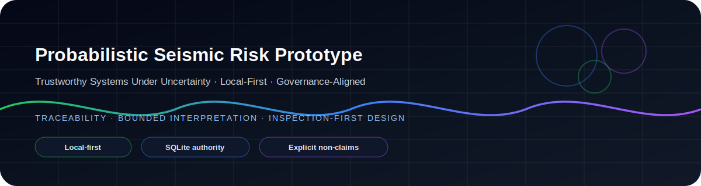
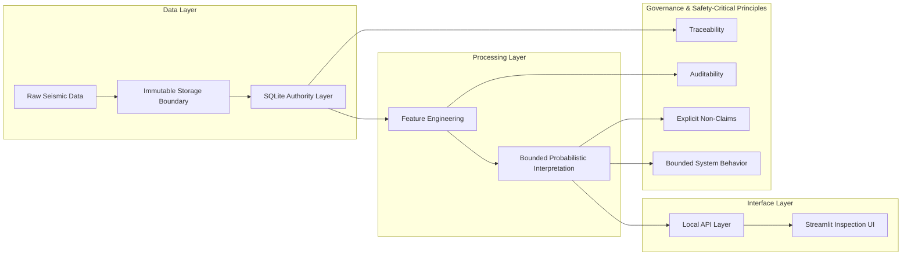

# Probabilistic Seismic Risk Prototype

  <b>Architecting Trustworthy Systems Under Uncertainty</b> 
  <i>Safety-Critical Thinking · Risk-Aware Design · Governance-Aligned Analytics</i>

  

  <i>Designed for inspection, not assumption.</i>

  
  
  
  

  

---

## Overview

A **local-first seismic risk analysis prototype** designed to demonstrate architectural discipline for uncertainty-bound analytical systems, with emphasis on:

- traceability  
- bounded probabilistic interpretation  
- inspection-first system design  
- governance-aligned analytical boundaries  

This project is not about earthquake prediction. It is about designing analytical systems that remain useful, inspectable, and defensible when prediction is fundamentally limited.

---

## Strategic Context

In critical infrastructure domains, system failure is rarely purely technical. It is also:

- epistemic  
- architectural  
- communicative  

This prototype addresses a central question:

> **How can analytical systems remain useful without exceeding their epistemic limits?**

---

## Architectural Value

This repository demonstrates the ability to:

- design **local-first systems** resilient to network dependency and external services  
- establish a **traceable data authority layer using SQLite**  
- preserve clear boundaries between raw evidence and derived artifacts  
- implement **bounded probabilistic interpretation**  
- deliver dual inspection surfaces through **local API + UI**  
- separate prototype capability from production, warning, or official authority claims  

---

## Architecture Overview

---

## Safety-Critical Relevance

The repository demonstrates patterns relevant to:

- risk-sensitive analytical platforms  
- decision-support systems under uncertainty  
- governance-heavy or regulated environments  
- systems where communication boundaries matter as much as computation  

### Key principles

- fail-safe communication through explicit non-claims  
- deterministic data handling with bounded interpretation  
- human-inspectable outputs  
- clear separation between evidence, features, interpretation, and presentation  

---

## AI & Governance Positioning

This system is governance-aligned by design:

- no implicit predictive claims  
- traceable transformations  
- inspection-ready architecture  
- compatible with controlled future ML integration  

**Governance-first, modeling-second.**

---

## System Snapshot

| Component        | Access |
|------------------|--------|
| Data authority   | `artifacts/sqlite/seismic_prototype.db` |
| Web interface    | http://127.0.0.1:8501 |
| Local API        | http://127.0.0.1:8000 |
| API docs         | http://127.0.0.1:8000/docs |

**Operational posture:**  
`local-first · offline-capable · designed for controlled inspection`

---

## Explicit Constraints

This repository does not provide:

- earthquake prediction  
- public alerting behavior  
- replacement of official seismic authorities  
- production-readiness claims  

> These constraints are intentional safeguards, not missing features.

---

## Evaluation Guide

From a systems architecture perspective, evaluate this repository through:

- architectural integrity under uncertainty  
- data lineage and auditability  
- clarity of system boundaries  
- governance alignment  
- inspection surface coherence across API and UI  

## Repository reading sequence

1. Read this README.
2. Open [`HOW_TO_READ_REPO.md`](HOW_TO_READ_REPO.md).
3. Run or inspect the surface using [`HOW_TO_RUN.md`](HOW_TO_RUN.md).
4. Open [`demo/controlled_run/visual_review_index.html`](demo/controlled_run/visual_review_index.html) after validating the live site.
5. Review canonical documentation under `docs/` only if deeper technical evaluation is required.

---

## Engineering Signal

This repository reflects:

- design under uncertainty constraints  
- risk-aware architectural thinking  
- governance and traceability discipline  
- ability to balance restraint, inspection, and extensibility  

---

## Forward Architecture Trajectory

Potential evolution:

- hybrid local-first + cloud architecture  
- controlled ML/probabilistic model integration  
- geospatial and streaming pipelines  
- validation and drift-monitoring workflows  
- alignment with AI assurance and model governance practices  

---

## Final Positioning

> This prototype is not optimized for visibility.  
>  
> It is optimized for trust under scrutiny.

---